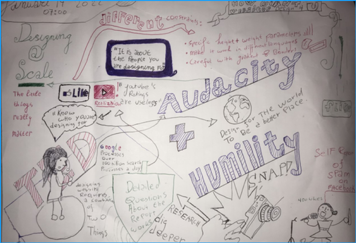

# Fix the Flow - Sketchnote ✍️

Maak een sketchnote van een online talk met als onderwerp 
iets uit het Frontend vakgebied van minstens 10minuten.

 

# Margaret Gould Stewart: How giant websites design for you 
BIjgaand treft u aan een sketchnote voor de vervangende oopdracht van We
❤️web

## Sketchnotes
<!-- Toon je gemaakte Sketchnotes en geef je plaatje een korte beschrijving -->

 
## Context

Deze leertaak hoort bij sprint 5 "Fix the Flow". 
Dit is een deeltaak die je individueel uitvoert. 

## Doel van deze opdracht
 
Met deze verslag heb ik geofend bij het maken van een visueel verslag (sketchnote). 

## Werkwijze 📌

Opdracht: maak een sketchnote van de talk van Margaret Gould Stewart: How giant websites design for you .

Deze opdracht gaat over de volgende fases van de DLC: [analyseren](#analyseren) en [ontwerpen](#ontwerpen).

### Analyseren🔍
Ik heb als doel om een sketchnote te maken over de talk 
van Margaret GOuld Stewart. Ik verwacht dat ik als eerst met de titel ga beginnen. 

### Ontwerp🎨

In de Ontwerp fase ben ik begonnen met schetsen. 

Aanpak

   Voor de talk begint.
   
   Teken het volgende:

1. Een titel (zie hiervoor de oefening tijdens de workshop).
2. Een simpel portretje van de persoon die de talk geeft (zie hiervoor de oefening tijdens de workshop).
3. De datum en tijd.
## Licentie

This work is licensed under [GNU GPLv3](./LICENSE).
